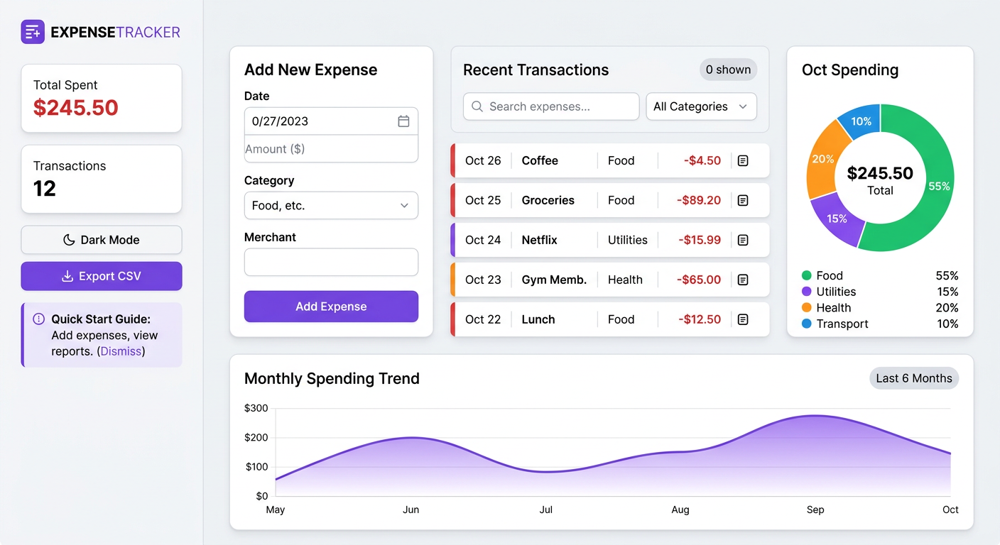
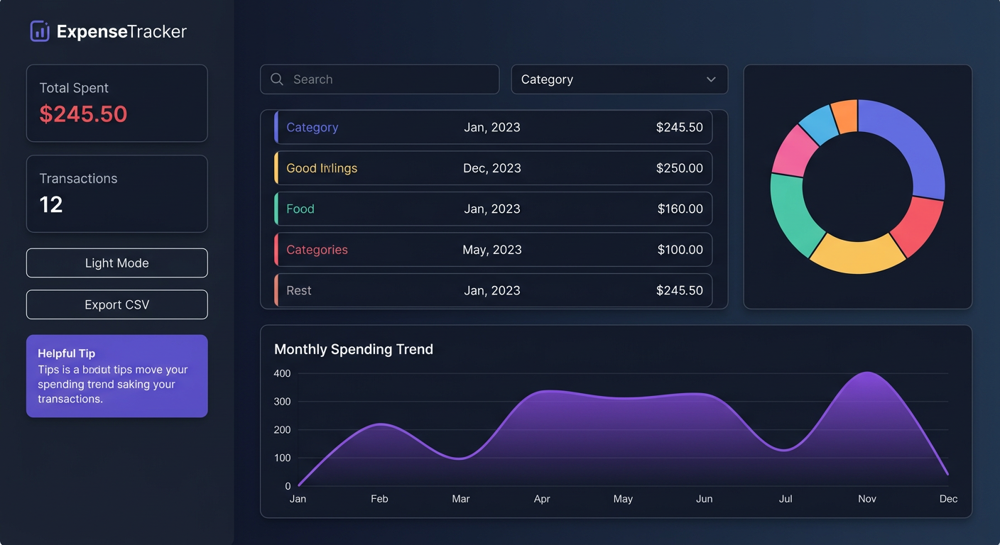

<div align="center">

# 💸 Expense Tracker

### A modern dashboard to track your daily expenses with live data visualization

[]()
[]()
[]()
[]()
[](LICENSE)

A sleek, modern expense tracker that helps you visualize your spending habits. Built with vanilla JavaScript and Chart.js for real-time data visualization. Features dark mode, search & filter, monthly trends, and CSV export!

[🚀 Live Demo](#) • [📦 Source Code](https://github.com/AryanJaiswara07/expense-tracker)

</div>

---

##  Features

| Feature | Description |
|---------|-------------|
|  **Live Doughnut Chart** | See spending by category update in real-time |
|  **Monthly Trend Line Chart** | Track your spending over the last 6 months |
|  **Dark Mode Toggle** | Beautiful dark theme with one click |
|  **Search & Filter** | Find expenses by text or category instantly |
| 📥 **Export to CSV** | Download your data for Excel or analysis |
| 💾 **Local Storage** | Your data saves automatically in your browser |
|  **7 Categories** | Food, Transport, Shopping, Bills, Entertainment, Health, Other |
| 🗑️ **Easy Management** | Add and delete expenses with one click |
| 📱 **Fully Responsive** | Beautiful dashboard on desktop and mobile |
| 🎯 **Smart Summary** | Total spent and transaction count at a glance |

---

##  App Preview

### Light Mode
<div align="center">



</div>

### Dark Mode
<div align="center">



</div>

---

## 🚀 Quick Start

### Option 1: Just Open It
1. Download and extract the files
2. Double-click `index.html`
3. Start tracking!

### Option 2: Live Server (Recommended)
```bash
# Install VS Code Live Server extension, then:
# Right-click index.html -> "Open with Live Server"
```

---

## 🎮 How to Use

### Adding an Expense:
1. **Enter a description** (e.g., "Lunch at cafe")
2. **Enter the amount** (e.g., 15.50)
3. **Select a category** (e.g., Food)
4. **Click "+ Add Expense"**
5. Watch the charts and total update instantly!

### Using Search & Filter:
- **Search**: Type in the search box to find expenses by description
- **Filter**: Use the category dropdown to show only specific categories
- Both work together! Search "coffee" in "Food" category

### Dark Mode:
- Click the ** Dark Mode** button in the sidebar
- Your preference saves automatically
- Charts update colors to match the theme!

### Export Data:
- Click **📥 Export CSV** in the sidebar
- Downloads a CSV file with all your transactions
- Open in Excel, Google Sheets, or any spreadsheet app

### Delete an Expense:
- Click the **✕** button next to any transaction

---

## 📂 Project Structure

```
expense-tracker/
├── index.html       # Main HTML with Chart.js CDN
├── style.css        # Modern dashboard styling with dark mode
├── script.js        # App logic, charts, search, filter, export
├── README.md        # Documentation
├── LICENSE          # MIT License
├── .gitignore
└── assets/
    ├── dashboard-light.png  # Light mode screenshot
    └── dashboard-dark.png   # Dark mode screenshot
```

---

##  Technical Highlights

- **Vanilla JavaScript** - No framework bloat, pure JS performance
- **Chart.js Integration** - Two chart types: doughnut + line
- **LocalStorage API** - Data persists across browser sessions
- **CSS Variables** - Clean theming system for dark mode
- **ES6+ Syntax** - Clean, modern JavaScript with arrow functions
- **Responsive Design** - CSS Grid & Flexbox for all screen sizes
- **Real-time Updates** - Charts update instantly on data changes

---

##  Customization

### Add a new category:
1. In `index.html`, add an option to the select:
   ```html
   <option value="Education"> Education</option>
   ```
2. In `script.js`, add a color to `categoryColors`:
   ```javascript
   'Education': '#00b894',
   ```

### Change the theme colors:
Edit CSS variables in `style.css`:
```css
:root {
    --primary: #6c5ce7;  /* Change this! */
}
```

### Modify chart styles:
Update chart options in `script.js` `initCharts()` function

---

## 🌐 Deploy to GitHub Pages

1. Push this repo to GitHub
2. Go to **Settings → Pages**
3. Select branch: `main` → `/ (root)`
4. Your tracker will be live at: `https://YOUR_USERNAME.github.io/expense-tracker/`

---

## ️ Future Enhancements

- [ ] Budget goals per category with progress bars
- [ ] Date range filtering (weekly/monthly/yearly)
- [ ] Recurring expenses (auto-add rent, subscriptions)
- [ ] Multi-currency support (USD, INR, EUR)
- [ ] Data import from CSV
- [ ] Expense splitting with friends

---

## 👤 Author

**Aryan Jaiswara**

- GitHub: [@AryanJaiswara07](https://github.com/AryanJaiswara07)
- Email: [aryanjaiswara69@gmail.com](mailto:aryanjaiswara69@gmail.com)

---

## 📝 License

MIT License — see [LICENSE](LICENSE) for details.

---

<div align="center">

Made with ❤️ by [Aryan Jaiswara](https://github.com/AryanJaiswara07)

**Track your money, master your future!** 💰

</div>
